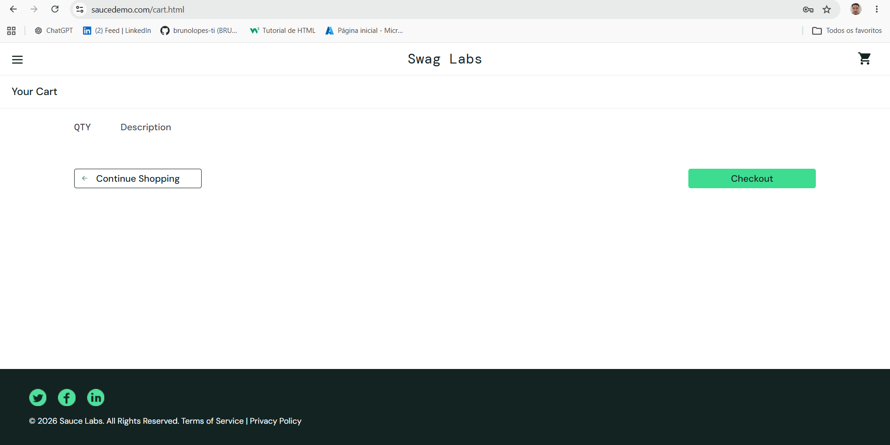
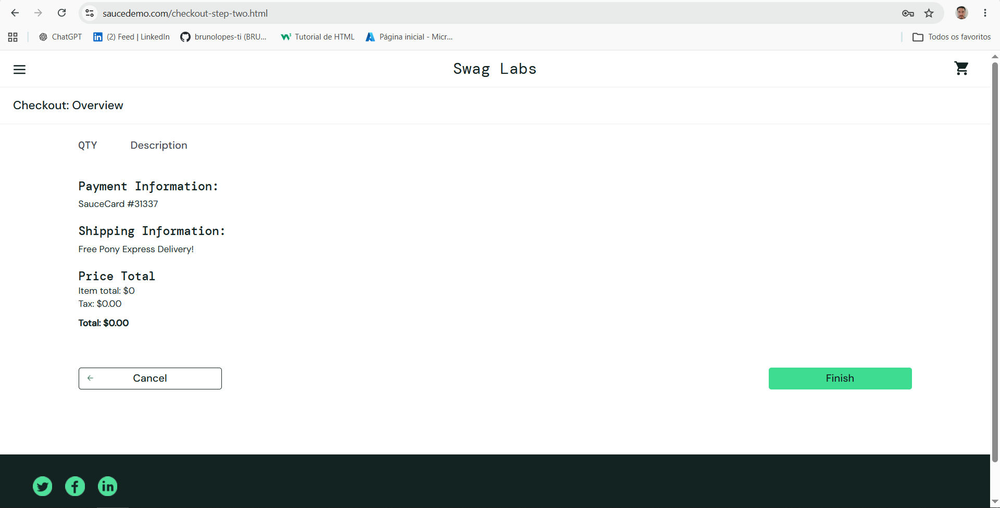
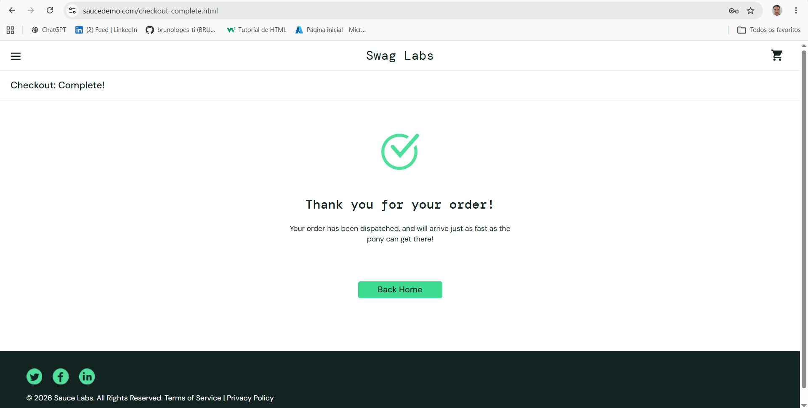
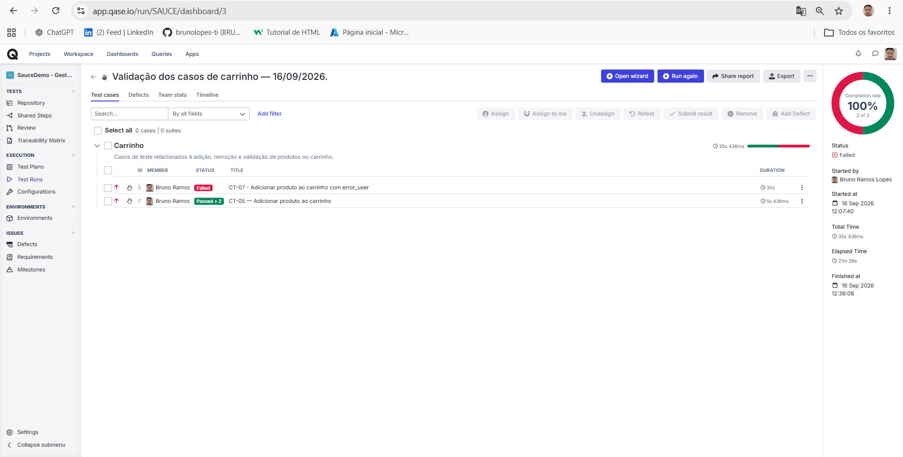
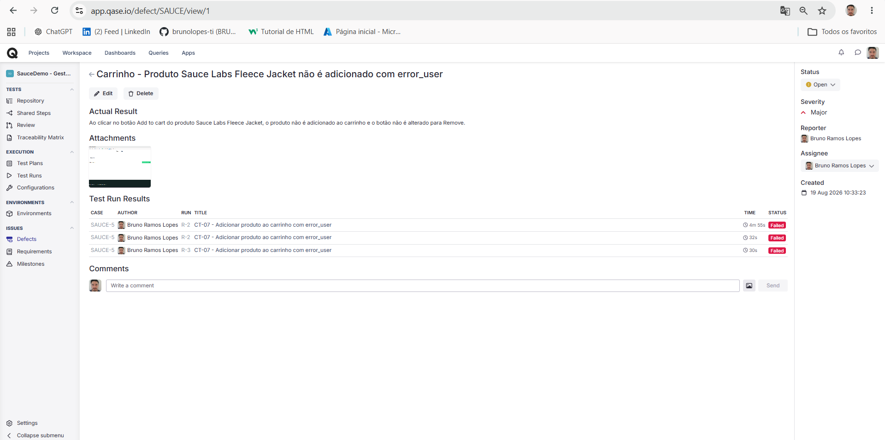
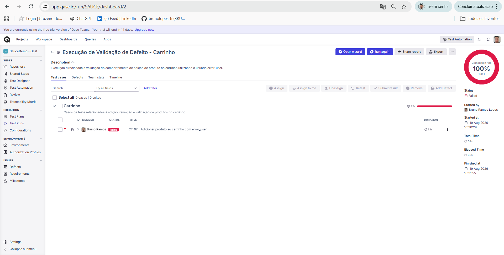

# Relatório de Bugs – QA Lab (SauceDemo)

Este documento reúne os comportamentos registrados durante os testes manuais do projeto, seus resultados esperados, evidências e vínculos com o Qase.

[Consultar os casos de teste manuais](../1.manual-tests/02-test-cases-saucedemo.md).

## Critérios de classificação

As classificações representam a avaliação adotada neste exercício de QA:

- **Severidade:** impacto do comportamento na funcionalidade testada;
- **Prioridade:** ordem sugerida para análise e tratamento.

A documentação manual utiliza Alta para o BUG-001. O Qase utiliza Major para o D-1, relacionado ao BUG-002. Os termos originais foram preservados, sem pressupor equivalência entre as escalas.

Os impactos descritos são qualitativos. Não representam perdas financeiras ou efeitos medidos em produção.

---

## BUG-001 – Sistema permite finalizar compra com carrinho vazio

| Campo | Valor |
| --- | --- |
| ID nesta documentação | BUG-001 |
| Caso relacionado | CT-14 |
| Severidade atribuída no exercício | Alta |
| Prioridade atribuída no exercício | Alta |
| Status documental | Aberto |
| Última reprodução documentada | 16/09/2026 |
| Natureza do resultado esperado | Regra de negócio adotada para o exercício |

### Ambiente da reprodução de 16/09/2026

| Item | Valor |
| --- | --- |
| Aplicação | SauceDemo |
| Sistema operacional | Windows |
| Navegador | Google Chrome |
| Modo de execução | Janela normal |
| Usuário | `standard_user` |

As versões do navegador e do sistema operacional não foram registradas.

O registro inicial informava execução em janela anônima. A reprodução de 16/09/2026 foi realizada em janela normal.

### Dados utilizados

| Campo | Valor |
| --- | --- |
| First Name | Teste |
| Last Name | QA |
| Zip/Postal Code | 70000000 |

### Pré-condições

- Usuário autenticado com `standard_user`;
- Carrinho sem produtos.

### Passos para reproduzir

1. Acessar o carrinho.
2. Confirmar que não há produtos.
3. Clicar em `Checkout`.
4. Preencher os dados indicados na tabela acima.
5. Clicar em `Continue`.
6. Verificar a ausência de produtos na página Overview e os valores exibidos.
7. Clicar em `Finish`.
8. Verificar a mensagem apresentada.

### Resultado esperado

Considerando a regra de negócio adotada neste exercício, o sistema deveria impedir a conclusão de uma compra sem produtos no carrinho.

### Resultado obtido

A aplicação permitiu avançar pelo checkout sem produtos.

Na página Overview, foram exibidos:

| Campo | Valor exibido |
| --- | --- |
| Item total | $0 |
| Tax | $0.00 |
| Total | $0.00 |

Após clicar em `Finish`, a aplicação abriu a página `checkout-complete.html` e exibiu:

```text
Thank you for your order!
```

O resultado foi considerado **Reprovado** em relação à regra adotada para o exercício.

As evidências demonstram o comportamento da interface. Não houve verificação de persistência de pedido em banco de dados ou processamento real de pagamento.

### Evidências

#### Carrinho inicialmente vazio



#### Overview sem produtos e com total zero



#### Confirmação de compra



### Caso relacionado

[CT-14 – Finalização da compra com carrinho vazio](../1.manual-tests/02-test-cases-saucedemo.md#ct-14---finalização-da-compra-com-carrinho-vazio)

Esta reprodução foi documentada separadamente da execução R-3 do Qase. Ela não altera o escopo nem os resultados daquela execução.

### Impacto e classificação

Em um sistema comercial, permitir a conclusão de pedidos sem itens poderia gerar registros inconsistentes e comprometer a integridade do fluxo de compra.

A severidade e a prioridade Alta foram atribuídas no exercício por envolverem a conclusão de um pedido em desacordo com a regra adotada.

### Limite da avaliação

A SauceDemo é uma aplicação pública de demonstração. Sem acesso aos requisitos oficiais, este registro representa uma divergência em relação à regra definida para o exercício, e não a confirmação de descumprimento de um requisito oficial do produto.

---

## BUG-002 – Produto Sauce Labs Fleece Jacket não é adicionado ao carrinho com error_user

| Campo | Valor |
| --- | --- |
| ID nesta documentação | BUG-002 |
| Caso na matriz manual | CT-15 |
| Registro do caso no Qase | SAUCE-5 |
| Título atual do caso no Qase | CT-07 – Adicionar produto ao carrinho com error_user |
| Defeito no Qase | D-1 |
| Severidade registrada no Qase | Major |
| Prioridade atribuída no exercício | Alta |
| Status no Qase | Open |
| Última reprodução documentada | 16/09/2026 — execução R-3 |

### Ambiente

| Item | Registro |
| --- | --- |
| Aplicação | SauceDemo |
| Usuário | `error_user` |
| Produto | Sauce Labs Fleece Jacket |
| Navegador | Google Chrome |
| Sistema operacional | Windows |
| Modo informado na documentação inicial | Janela anônima |
| Modo utilizado na R-3 | Janela normal |

As versões do navegador e do sistema operacional não foram registradas neste relatório.

### Pré-condições

- Usuário autenticado com `error_user`;
- Página de produtos aberta;
- Carrinho inicialmente vazio;
- Produto Sauce Labs Fleece Jacket disponível com o botão `Add to cart`.

### Passos para reproduzir

1. Localizar o produto Sauce Labs Fleece Jacket.
2. Clicar em `Add to cart` desse produto.
3. Observar se o contador do carrinho passa a exibir `1`.
4. Observar se o botão do produto muda para `Remove`.
5. Acessar o carrinho.
6. Verificar se o Sauce Labs Fleece Jacket está presente.

### Resultado esperado

Após clicar em `Add to cart`, a aplicação deveria:

- Adicionar o produto;
- Exibir `1` no contador do carrinho;
- Alterar o botão para `Remove`;
- Exibir o Sauce Labs Fleece Jacket na página do carrinho.

### Resultado obtido no registro inicial

A documentação original informa:

- Produto não adicionado;
- Contador do carrinho sem atualização;
- Botão mantido como `Add to cart`;
- Nenhuma mensagem de erro apresentada na interface.

### Resultado confirmado na R-3 — 16/09/2026

Com `error_user` e carrinho inicialmente vazio, foi realizada uma tentativa de adicionar o Sauce Labs Fleece Jacket.

Após acessar o carrinho, o produto não estava presente e o carrinho permanecia vazio.

O caso SAUCE-5 / CT-07 foi registrado como **Failed** e vinculado ao defeito existente **D-1**.

O defeito permaneceu **Open**.

### Evidências atuais

#### Carrinho vazio após a tentativa de adição


A imagem documenta o estado final do carrinho. O usuário, o produto selecionado e a ação anterior são descritos no registro da execução.

#### Resultado da execução R-3



#### Vínculo com o defeito existente



### Evidências históricas

#### Execução com falha



#### Registro do defeito


#### Nova execução pela funcionalidade Retest


### Caso manual relacionado

[CT-15 – Adição de produto ao carrinho com error_user](../1.manual-tests/02-test-cases-saucedemo.md#ct-15---adição-de-produto-ao-carrinho-com-error_user)

### Impacto e classificação

A falha impede a adição do produto testado ao carrinho com o usuário utilizado, interrompendo esse cenário do fluxo de compra.

A severidade Major registrada no Qase e a prioridade Alta atribuída no exercício refletem o comprometimento dessa funcionalidade.

A reprodução documentada se limita à combinação `error_user` e Sauce Labs Fleece Jacket. Ela não demonstra que todos os produtos ou usuários são afetados.

### Novas execuções e acompanhamento

O histórico do D-1 apresenta dois resultados Failed associados à R-2 e um resultado Failed associado à R-3.

As novas execuções foram vinculadas ao mesmo defeito, preservando a rastreabilidade e evitando duplicidade.

O uso da funcionalidade **Retest** do Qase confirmou a persistência da falha. Não houve validação de uma correção disponibilizada pela aplicação.

### Rastreabilidade dos casos

O registro SAUCE-5 foi originalmente identificado como CT-05 e posteriormente alterado para CT-07, com `error_user`.

O cenário de adição com `standard_user` foi preservado no clone SAUCE-7, identificado como CT-05.

| Cenário | Registro atual no Qase | Caso manual |
| --- | --- | --- |
| Adicionar produto com standard_user | SAUCE-7 / CT-05 | CT-06 |
| Adicionar Fleece Jacket com error_user | SAUCE-5 / CT-07 | CT-15 |

As imagens e execuções anteriores foram preservadas. Por isso, o registro SAUCE-5 pode aparecer com um título anterior em evidências históricas.

### Histórico do identificador BUG-002

Uma versão anterior da documentação utilizava o identificador BUG-002 para um relato relacionado à validação de campos do checkout. Na versão atual, esse identificador está associado à falha de adição do Fleece Jacket.

Esses relatos não devem ser tratados como o mesmo comportamento. O registro anterior permanece no histórico do Git e precisa de revisão própria antes de ser reclassificado ou receber outro identificador.

O defeito **D-1 do Qase** identifica especificamente a falha de adição do Fleece Jacket com `error_user`.

---

## Resumo dos registros atuais

| ID | Comportamento | Caso manual | Registro no Qase | Severidade | Status |
| --- | --- | --- | --- | --- | --- |
| BUG-001 | Compra concluída com carrinho vazio | CT-14 | Não registrado | Alta | Aberto |
| BUG-002 | Fleece Jacket não adicionado com `error_user` | CT-15 | D-1 | Major (Qase) | Aberto |

> O BUG-001 é acompanhado apenas na documentação manual do projeto.  
> O BUG-002 também possui acompanhamento no Qase por meio do defeito D-1.

---

## Resumo da execução R-3

**Data:** 16/09/2026
**Nome:** Validação dos casos de carrinho

| Caso no Qase | Cenário | Resultado |
| --- | --- | --- |
| SAUCE-7 / CT-05 | Adicionar Backpack com standard_user | Passed |
| SAUCE-5 / CT-07 | Adicionar Fleece Jacket com error_user | Failed |

- 2 casos executados;
- 1 aprovado;
- 1 reprovado;
- 100% de conclusão;
- 50% de aprovação;
- Resultado com falha vinculado ao D-1;
- Defeito mantido como Open.

O cenário aprovado usa outro usuário e outro produto. Seu resultado não comprova a causa da falha do Fleece Jacket.

Esta execução não incluiu o CT-14 e não representa uma nova execução de toda a matriz manual.

---

## Fluxo de acompanhamento demonstrado

Para o defeito D-1, foram documentadas as seguintes etapas:

1. Execução do caso;
2. Identificação da divergência entre esperado e obtido;
3. Registro do defeito;
4. Vinculação entre caso, execução e defeito;
5. Nova execução do cenário;
6. Confirmação da persistência da falha;
7. Manutenção do status Open.

O acompanhamento termina com o defeito ainda aberto. Não houve validação de correção nem encerramento do D-1.

---
