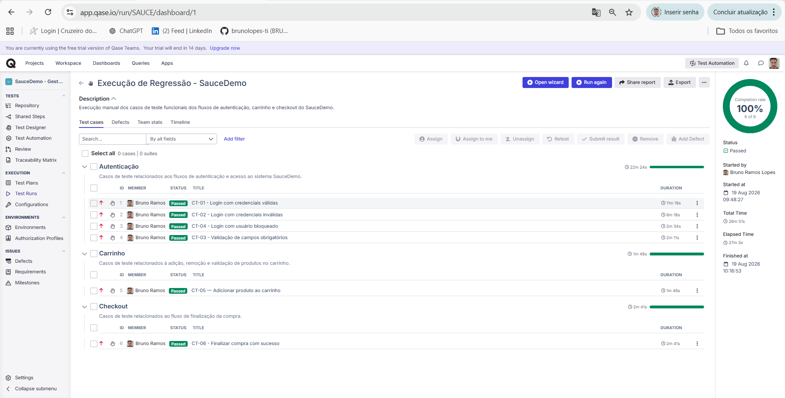
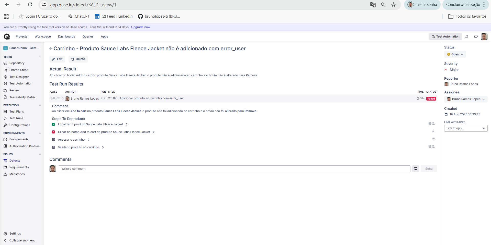
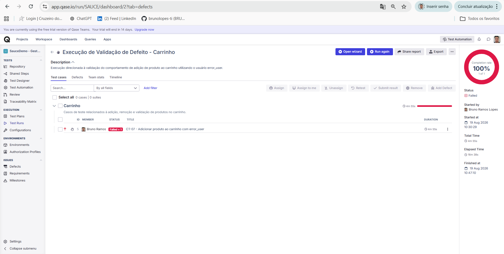

# QA Lab – Testes Manuais, Gestão de Testes e Validação de Bugs


Projeto prático de **Quality Assurance** desenvolvido para aplicar testes manuais, elaboração de casos de teste, execução funcional, identificação de defeitos, análise de impacto e gestão do ciclo de testes utilizando **Qase**.

O projeto utiliza a aplicação SauceDemo para simular atividades comuns de QA, desde a elaboração e execução de cenários até o registro de defeitos, rastreabilidade e reteste.

---

## Objetivo

Validar funcionalidades críticas de uma aplicação Web e demonstrar práticas de QA envolvendo:

- Planejamento de testes;
- Elaboração de casos de teste;
- Execução manual;
- Testes positivos e negativos;
- Testes funcionais;
- Testes de regressão;
- Registro e documentação de bugs;
- Análise de impacto;
- Gestão de testes com Qase;
- Organização de casos em suítes;
- Test Runs;
- Registro de defeitos;
- Rastreabilidade;
- Reteste.

---

## Tecnologias e ferramentas

- Qase;
- Google Chrome;
- SauceDemo;
- Visual Studio Code;
- Git;
- GitHub;
- Markdown.

---

# Testes manuais

## Métricas do projeto

| **Indicador** | **Valor** |
|---|---:|
| Casos de teste manuais | 15 |
| Casos aprovados | 13 |
| Casos reprovados | 2 |
| Bugs documentados | 2 |
| Taxa de aprovação | 86,6% |
| Maior severidade identificada | Alta |

---

## Escopo dos testes

Os testes manuais contemplam:

- Autenticação;
- Login válido;
- Login inválido;
- Usuário bloqueado;
- Validação de mensagens de erro;
- Manipulação do carrinho;
- Adição de produtos;
- Validação do contador de itens;
- Fluxo de checkout;
- Validação de campos obrigatórios;
- Validação de cálculo de valores;
- Validação de subtotal;
- Validação de taxa;
- Validação de valor total;
- Finalização da compra.

---

## Ambiente de teste

- **Sistema Operacional:** Windows;
- **Navegador:** Google Chrome;
- **Modo de execução:** janela anônima;
- **Editor:** Visual Studio Code;
- **Controle de versão:** Git;
- **Hospedagem:** GitHub;
- **Aplicação testada:** SauceDemo.

Aplicação:

[https://www.saucedemo.com/](https://www.saucedemo.com/)

---

## Estrutura do projeto

```text
qa-lab-project/
├── 1.manual-tests/
├── 2.bug-reports/
├── 3.evidencias/
│   └── qase/
│       ├── qase-suite-autenticacao.png
│       ├── qase-execucao-testes.png
│       ├── qase-execucao-defeito-failed.png
│       ├── qase-defeito-registrado.png
│       └── qase-reteste.png
└── README.md
```

---

## Matriz de execução dos testes manuais

| **ID** | **Cenário** | **Status** |
|---|---|---|
| CT-01 | Login válido | Aprovado |
| CT-02 | Senha inválida | Aprovado |
| CT-03 | Usuário inválido | Aprovado |
| CT-04 | Campos obrigatórios no login | Aprovado |
| CT-05 | Usuário bloqueado | Aprovado |
| CT-06 | Adição de produto ao carrinho | Aprovado |
| CT-07 | Validação de produtos no carrinho | Aprovado |
| CT-08 | Acesso ao checkout | Aprovado |
| CT-09 | First Name obrigatório | Aprovado |
| CT-10 | Last Name obrigatório | Aprovado |
| CT-11 | Postal Code obrigatório | Aprovado |
| CT-12 | Validação da página Overview | Aprovado |
| CT-13 | Finalização da compra | Aprovado |
| CT-14 | Finalizar compra com carrinho vazio | Reprovado |
| CT-15 | Validação de dados inválidos no checkout | Reprovado |

---

## Bugs encontrados nos testes manuais

Durante a execução dos cenários foram identificados e documentados dois defeitos.

### BUG-001 – Sistema permite finalizar compra com carrinho vazio

O sistema permite avançar pelo processo de checkout e concluir uma compra mesmo sem produtos adicionados ao carrinho.

[Consultar documentação do BUG-001](./2.bug-reports/report-bugs.md)

### BUG-002 – Falta de validação nos campos do checkout

O sistema aceita determinados dados inválidos durante o preenchimento das informações do checkout.

[Consultar documentação do BUG-002](./2.bug-reports/report-bugs.md)

---

## Impacto de negócio

Os defeitos encontrados podem gerar impactos como:

- Pedidos inválidos;
- Inconsistência em dados de clientes;
- Problemas operacionais;
- Problemas financeiros;
- Falhas no fluxo de compra;
- Experiência negativa para o usuário.

A análise dos cenários reforça a importância da validação funcional antes da disponibilização de uma funcionalidade em produção.

---

# Gestão de testes com Qase

Além da documentação manual armazenada no repositório, o projeto foi evoluído utilizando o **Qase** como ferramenta de gerenciamento de testes.

O objetivo desta etapa foi simular um fluxo mais próximo do utilizado por equipes de QA, envolvendo:

**caso de teste → suíte → execução → resultado → defeito → rastreabilidade → reteste**

---

## Organização das suítes

Os casos utilizados nessa etapa foram organizados em três suítes funcionais:

```text
Autenticação
Carrinho
Checkout
```

Essa organização permite agrupar os cenários por funcionalidade e facilita a manutenção e execução seletiva dos testes.

---

## Casos cadastrados no Qase

Foram cadastrados os seguintes cenários para demonstrar a gestão de testes:

### Autenticação

- CT-01 – Login com credenciais válidas;
- CT-02 – Login com credenciais inválidas;
- CT-03 – Validação de campos obrigatórios;
- CT-04 – Login com usuário bloqueado.

### Carrinho

- CT-05 – Adicionar produto ao carrinho.

### Checkout

- CT-06 – Finalizar compra com sucesso.

### Validação direcionada a defeito

- CT-07 – Adicionar produto ao carrinho com `error_user`.

> A numeração utilizada no Qase representa este ciclo específico de gestão de testes e não substitui a matriz original com 15 casos manuais documentada anteriormente.

---

## Propriedades utilizadas nos casos

Os casos foram configurados com informações de classificação para facilitar organização e rastreabilidade.

Entre as propriedades utilizadas estão:

- Severity;
- Priority;
- Status;
- Type;
- Behavior;
- Layer;
- Automation Status;
- Flaky.

Os casos também possuem:

- Pré-condições;
- Passos de execução;
- Dados de teste;
- Resultado esperado.

---

# Execução de regressão

Foi criado no Qase o Test Run:

```text
Execução de Regressão - SauceDemo
```

A execução contemplou seis casos das suítes de Autenticação, Carrinho e Checkout.

## Resultado

| **Indicador** | **Resultado** |
|---|---:|
| Casos executados | 6 |
| Casos aprovados | 6 |
| Casos reprovados | 0 |
| Taxa de conclusão | 100% |
| Taxa de aprovação | 100% |

Resultado:

```text
6 / 6 Passed
100% concluído
```

### Evidência



---

# Validação de defeito com error_user

Para demonstrar o fluxo completo de tratamento de defeitos, foi criado um cenário específico utilizando o usuário:

```text
error_user
```

Caso utilizado:

```text
CT-07 - Adicionar produto ao carrinho com error_user
```

Produto utilizado:

```text
Sauce Labs Fleece Jacket
```

---

## Comportamento esperado

Ao clicar em:

```text
Add to cart
```

o sistema deveria:

- Adicionar o produto ao carrinho;
- Atualizar o contador do carrinho;
- Alterar o botão de `Add to cart` para `Remove`.

---

## Comportamento obtido

Durante a execução, foi identificado o seguinte comportamento:

```text
Ao clicar no botão Add to cart do produto Sauce Labs Fleece Jacket,
o produto não é adicionado ao carrinho e o botão não é alterado para Remove.
```

Nenhuma mensagem de erro é exibida pela aplicação.

O caso foi marcado como:

```text
Failed
```

---

## Registro do defeito

Após a reprodução do problema, foi criado um defeito no Qase:

```text
Carrinho - Produto Sauce Labs Fleece Jacket não é adicionado com error_user
```

Classificação utilizada:

| **Propriedade** | **Valor** |
|---|---|
| Severidade | Major |
| Status | Open |
| Caso relacionado | CT-07 |
| Execução relacionada | Failed |

O defeito foi vinculado ao caso de teste e à execução que originou a falha, mantendo a rastreabilidade do ciclo.

### Evidência



---

# Reteste

Após o registro do defeito foi realizada uma nova execução do CT-07 utilizando a funcionalidade de reteste do Qase.

O mesmo cenário foi executado novamente com os mesmos dados e pré-condições.

## Resultado do reteste

O defeito foi reproduzido novamente.

Resultado documentado:

```text
Defeito reproduzido novamente no reteste.

Ao clicar em Add to cart no produto Sauce Labs Fleece Jacket,
o produto continua não sendo adicionado ao carrinho
e o botão não é alterado para Remove.
```

A nova execução foi vinculada ao **mesmo defeito existente**, evitando a criação de registros duplicados.

Como não houve correção na aplicação, o defeito permaneceu:

```text
Open
```

Resultado do caso:

```text
Failed +1
```

### Evidência



---

# Fluxo de gestão demonstrado

A etapa com Qase demonstra um ciclo completo de gestão de testes:

```text
Planejamento
    ↓
Criação dos casos
    ↓
Organização em suítes
    ↓
Test Run
    ↓
Execução
    ↓
Identificação da falha
    ↓
Registro do defeito
    ↓
Vinculação caso ↔ execução ↔ defeito
    ↓
Reteste
    ↓
Defeito reproduzido
    ↓
Status mantido como Open
```

---

## Evidências do Qase

As principais evidências estão armazenadas em:

```text
3.evidencias/qase/
```

Arquivos:

```text
qase-suite-autenticacao.png
qase-execucao-testes.png
qase-execucao-defeito-failed.png
qase-defeito-registrado.png
qase-reteste.png
```

Entre elas estão registros de:

- Organização dos casos;
- Execução da regressão;
- Resultado Passed;
- Execução Failed;
- Registro do defeito;
- Severidade Major;
- Status Open;
- Relacionamento com o CT-07;
- Reteste;
- Nova reprodução da falha.

---

# Metodologia utilizada

Durante o projeto foram aplicadas práticas como:

- Elaboração de casos com identificação única;
- Definição de pré-condições;
- Separação entre resultado esperado e resultado obtido;
- Execução controlada em ambiente limpo;
- Uso de cenários positivos e negativos;
- Registro literal das mensagens retornadas pela aplicação;
- Organização dos testes por fluxo funcional;
- Registro estruturado de defeitos;
- Classificação de severidade;
- Organização dos casos em suítes;
- Test Runs;
- Execução de regressão;
- Reteste;
- Rastreabilidade entre caso de teste, execução e defeito;
- Organização de evidências;
- Versionamento com Git e GitHub.

---

# Competências demonstradas

Este projeto demonstra conhecimentos práticos em:

- Quality Assurance;
- Testes manuais;
- Testes funcionais;
- Testes positivos e negativos;
- Testes de regressão;
- Casos de teste;
- Cenários de teste;
- Planejamento de testes;
- Gestão de testes;
- Qase;
- Test Suites;
- Test Runs;
- Bug Tracking;
- Registro de defeitos;
- Severidade;
- Rastreabilidade;
- Reteste;
- Análise de impacto;
- Evidências de teste;
- Documentação técnica;
- Git;
- GitHub.

---

# Status do projeto

**Concluído nesta etapa.**

O projeto atualmente demonstra duas frentes complementares:

### Testes manuais

- 15 casos documentados;
- 13 casos aprovados;
- 2 casos reprovados;
- 2 bugs documentados;
- Análise de impacto de negócio.

### Gestão de testes com Qase

- 3 suítes;
- 7 casos utilizados na demonstração;
- Execução de regressão;
- 6/6 casos aprovados na regressão;
- Execução de cenário com falha reproduzível;
- Registro de defeito;
- Severidade Major;
- Rastreabilidade entre caso, execução e defeito;
- Reteste;
- Defeito reproduzido;
- Status mantido como Open.

---

# Próximas melhorias possíveis

- Expandir a quantidade de casos gerenciados no Qase;
- Criar novos Test Runs por funcionalidade;
- Explorar planos de teste;
- Trabalhar diferentes prioridades e severidades;
- Ampliar cenários de regressão;
- Integrar futuramente a gestão manual com cenários automatizados;
- Explorar ferramentas complementares de gestão de defeitos.

---

# Autor

**Bruno Ramos Lopes**

LinkedIn: [linkedin.com/in/brunolopes-ti](https://linkedin.com/in/brunolopes-ti)  
GitHub: [github.com/brunolopes-ti](https://github.com/brunolopes-ti)
